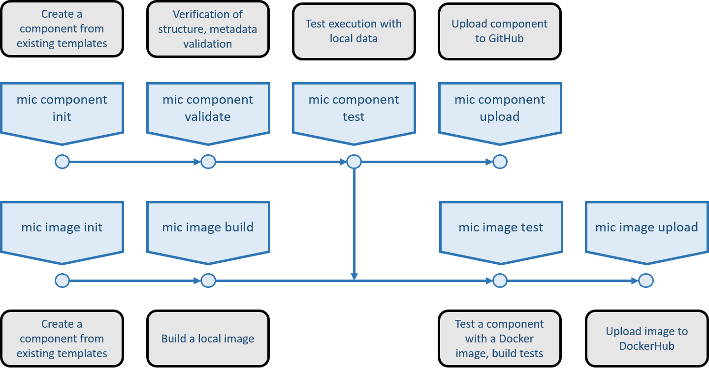

# Model Insertion CLI (MIC) 

Model Insertion CLI (MIC) is a command-line interface for addming  models on a Model Catalog Service.

MIC is an application that ask the information of your model, model version, model configuration, parameters, inputs, outputs, authors and contribuors.

MIC has been tested in OSX and Windows (currently under test in Linux). Mic is installed through a simple pip command:

`pip install mic`

Please report any issue [here](https://github.com/mintproject/mic/issues/new/choose).

## Features

- [x] Create a new model/model configuration entry including: Author, Contributors, Model Version, Model Configuration, Parameters, Inputs and Outputs.
- [x] Save model metadata as a file
- [x] Submit model metadata to the Model Catalog Server (you must have an account)

# Usage

## Add a new model

To add a model, just type:

```bash
mic model add
```

To add new model configurations, type:

```bash
mic modelconfiguration add
```

Full documentation available at: [https://mic-cli.readthedocs.io/en/latest/](https://mic-cli.readthedocs.io/en/latest/)

## Next Features



The figure above highlights the next features we will support in MIC:

- [ ] Initializing a component making sure it is consistent with its metadata 
- [ ] Validating component metadata
- [ ] Testing that a component can be executed with local data, creating unit tests.
- [ ] Upload a valid component to GitHub
- [ ] Help initializing a Docker image for capturing the dependencies of a component
- [ ] Help building a Docker image
- [ ] Test a Docker image with a component
- [ ] Support uploading a tested Docker image to DockerHub